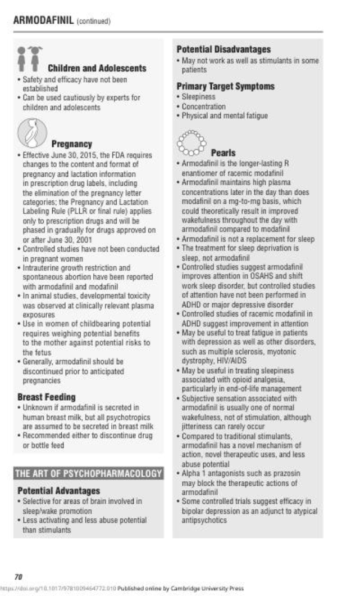
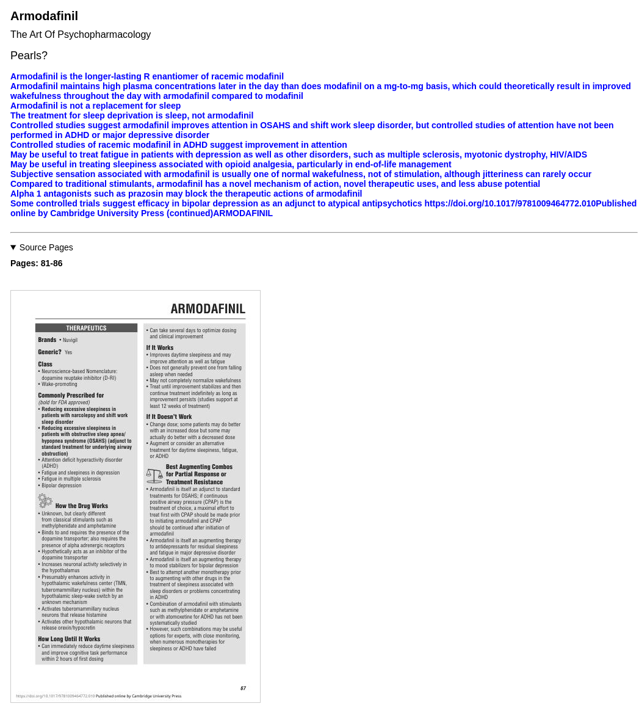
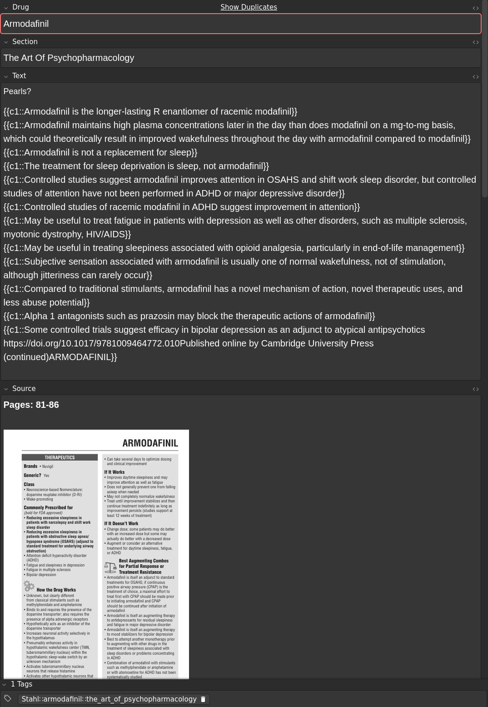

**[Français](README_FR.md)** | **English**

# Stahl Ankifier

A Python script to convert the PDF of **Stahl's Essential Psychopharmacology: Prescriber's Guide, 8th Edition** into Anki flashcards for efficient memorization.

In other words, it turns this:


Into something like this:


**Book Information:**
- Title: Prescriber's Guide - Stahl's Essential Psychopharmacology, 8th Edition
- ISBN: 9781009464772
- DOI: https://doi.org/10.1017/9781009464772

**Note:** This tool is designed for individuals who own the PDF version of this specific edition of the Prescriber's Guide. This script does not contain or distribute any copyrighted content from the book - it only provides functionality to transform your own purchased PDF into Anki flashcards for personal study purposes.

## Overview

This script parses the PDF structure of the Prescriber's Guide (8th Edition) and automatically generates Anki flashcards organized by:
- Drug name
- Major sections (H1 headers)
- Specific topics (H2 headers)

Each card includes:
- The question/topic
- The answer content with preserved formatting
- Source page images for reference
- Hierarchical tags for organization

Created with assistance from [aider.chat](https://github.com/Aider-AI/aider/).

## 🤝 Not Comfortable with Python?

**If you're not comfortable using Python or are having trouble running this script, don't worry!**

You can contact me and if you provide proof that you own the PDF, I'll be happy to send you the pre-converted Anki deck directly.

Reach out via:
- **GitHub Issues**: Open an issue on this repository
- **Email**: Contact me via my website at [https://olicorne.org](https://olicorne.org)

This way everyone who owns the book can benefit from the flashcards, regardless of technical skill level :)

## Features

- **Automatic structure detection**: Identifies drug chapters and hierarchical sections
- **Four card formats**: 
  - Basic Q&A cards with separate question/answer fields (default)
  - Single cloze deletion wrapping the entire answer (`--format singlecloze`)
  - One cloze per paragraph, all using c1 (`--format onecloze`)
  - Multi-cloze with sequential numbering per paragraph (`--format multicloze`)
- **Visual reference**: Optionally includes source page images on each card
- **Smart formatting**: 
  - Preserves important formatting (bold, italic, links)
  - Merges split paragraphs from PDF line wrapping
  - Removes page headers and extraneous markup
- **Organized tagging**: Cards are tagged by drug and section for easy filtering

## Installation

This script uses [PEP 723](https://peps.python.org/pep-0723/) inline script metadata, so you can run it directly with `uv`:

```bash
uv run stahl_ankifier.py <path_to_your_pdf>
```

The script will automatically install all required dependencies on first run.

### Manual Installation

If you prefer to install dependencies manually:

```bash
pip install pymupdf==1.26.4 beautifulsoup4==4.14.2 loguru==0.7.3 tqdm==4.67.1 genanki==0.13.1 Pillow==12.0.0
```

## Usage

### Basic Q&A Cards (Default)

```bash
uv run stahl_ankifier.py your_stahl_pdf.pdf
```

This creates a deck with separate fields for drug name, section, question, and answer.

### Cloze Deletion Cards

The script supports three cloze deletion formats:

**Single cloze (entire answer wrapped in c1):**
```bash
uv run stahl_ankifier.py your_stahl_pdf.pdf --format singlecloze
```

**One cloze per paragraph (all using c1):**
```bash
uv run stahl_ankifier.py your_stahl_pdf.pdf --format onecloze
```

**Multi-cloze (sequential numbering per paragraph):**
```bash
uv run stahl_ankifier.py your_stahl_pdf.pdf --format multicloze
```

### Excluding Page Images

By default, source page images are included in each card. To exclude them and reduce deck size:

```bash
uv run stahl_ankifier.py your_stahl_pdf.pdf --no-include-images
```

### Output

The script generates an `.apkg` file (e.g., `stahl_drugs_v1.0.0.apkg`) that can be imported directly into Anki.

The resulting deck contains approximately **787 cards** and is about **57 MB** in size (including source page images).

<details>
<summary>Click for images</summary>

- Original page:


- Card content (as of version `2.1.3`)


- Card appearance (as of version `2.1.3`)


</details>

## Legal Notice

**This tool is completely legal for at least the following reasons:**

1. **No Content Distribution**: This script does not contain, distribute, or provide access to any copyrighted content from Stahl's Essential Psychopharmacology.

2. **Personal Use Only**: The tool is intended solely for individuals who have legally purchased their own copy of the PDF.

3. **Format Conversion**: The script merely transforms content from one format (PDF) to another (Anki flashcards) for your personal study purposes - similar to taking personal notes or creating your own study materials.

4. **Fair Use**: Creating personal study materials from legally purchased educational content falls under fair use doctrine in most jurisdictions.

## Support

If you encounter any issues or have questions:

- **GitHub Issues**: Open an issue on this repository
- **Email**: Contact me via my website at [https://olicorne.org](https://olicorne.org)

## License

This project is licensed under the GNU General Public License v3.

See the [LICENSE](LICENSE) file for full license text.

## Contributing

Contributions are welcome! Please feel free to submit pull requests or open issues for bugs and feature requests.

## Disclaimer

This software is provided "as is" without warranty of any kind. The author is not affiliated with or endorsed by the publishers of Stahl's Essential Psychopharmacology: Prescriber's Guide. Users are responsible for ensuring their use of this tool complies with applicable copyright laws in their jurisdiction.
