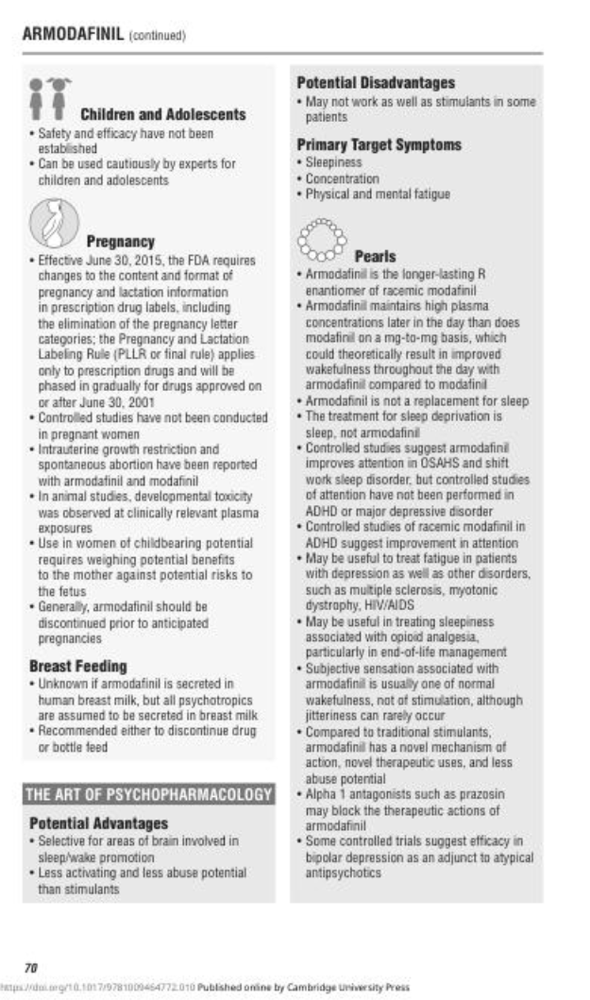
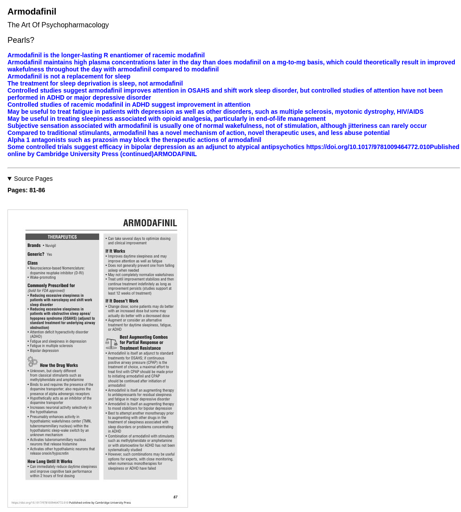
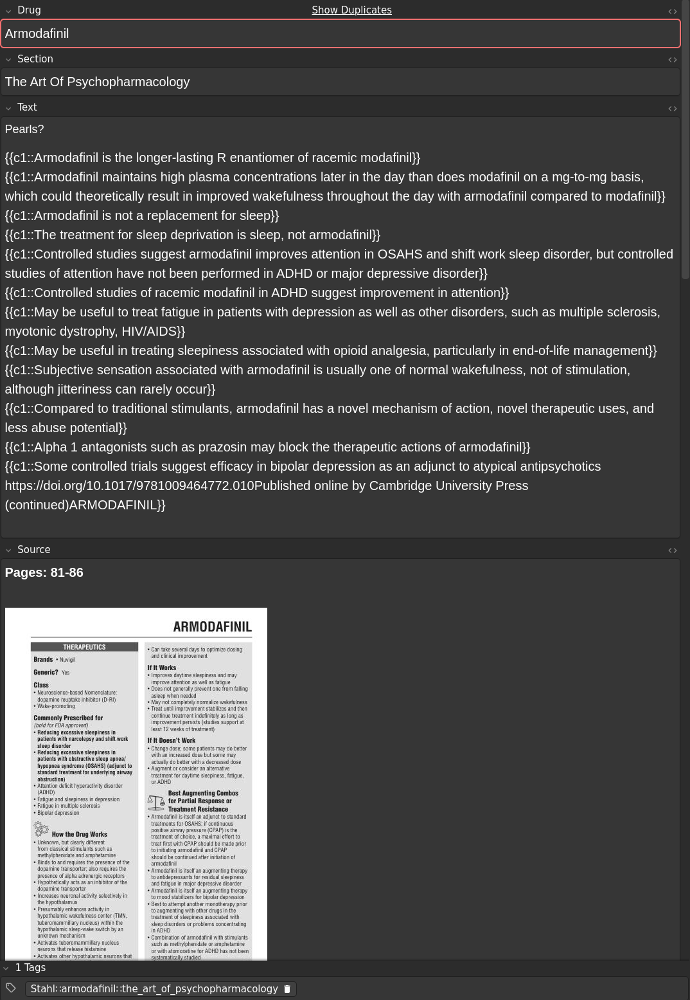

**Français** | **[English](README.md)**

# Stahl Ankifier

Un script Python pour convertir le PDF de **Stahl's Essential Psychopharmacology: Prescriber's Guide, 8e Édition** en cartes Anki pour une mémorisation efficace.

En d'autres termes, il transforme ceci :


En quelque chose comme ceci :


**Informations sur le livre :**
- Titre : Prescriber's Guide - Stahl's Essential Psychopharmacology, 8e Édition
- ISBN : 9781009464772
- DOI : https://doi.org/10.1017/9781009464772

**Remarque :** Cet outil est conçu pour les personnes qui possèdent la version PDF de cette édition spécifique du Prescriber's Guide. Ce script ne contient ni ne distribue aucun contenu protégé par des droits d'auteur du livre - il fournit uniquement des fonctionnalités pour transformer votre propre PDF acheté en cartes Anki à des fins d'étude personnelle.

## Vue d'ensemble

Ce script analyse la structure PDF du Prescriber's Guide (8e Édition) et génère automatiquement des cartes Anki organisées par :
- Nom du médicament
- Sections principales (en-têtes H1)
- Sujets spécifiques (en-têtes H2)

Chaque carte comprend :
- La question/le sujet
- Le contenu de la réponse avec formatage préservé
- Images des pages sources pour référence
- Tags hiérarchiques pour l'organisation

Créé avec l'assistance de [aider.chat](https://github.com/Aider-AI/aider/).

## 🤝 Pas à l'aise avec Python ?

**Si vous n'êtes pas à l'aise avec Python ou rencontrez des difficultés pour exécuter ce script, ne vous inquiétez pas !**

Vous pouvez me contacter et si vous fournissez une preuve que vous possédez le PDF, je serai heureux de vous envoyer directement le paquet Anki pré-converti.

Contactez-moi via :
- **GitHub Issues** : Ouvrez un ticket sur ce dépôt
- **Email** : Contactez-moi via mon site web à [https://olicorne.org](https://olicorne.org)

De cette façon, toute personne possédant le livre peut bénéficier des cartes mémoire, quel que soit son niveau technique :)

## Fonctionnalités

- **Détection automatique de la structure** : Identifie les chapitres sur les médicaments et les sections hiérarchiques
- **Quatre formats de cartes** :
  - Cartes Q&R basiques avec champs question/réponse séparés (par défaut)
  - Suppression à trous simple enveloppant la réponse entière (`--format singlecloze`)
  - Une suppression à trous par ligne, toutes utilisant c1 (`--format onecloze`)
  - Multi-suppressions à trous avec numérotation séquentielle par ligne (`--format multicloze`)
- **Référence visuelle** : Inclut optionnellement les images des pages sources sur chaque carte. Le texte intégral de chaque page est intégré dans l'attribut title de l'image, rendant tout le contenu directement consultable dans le navigateur d'Anki
- **Formatage intelligent** :
  - Préserve le formatage important (gras, italique, liens)
  - Fusionne les paragraphes divisés par le retour à la ligne du PDF
  - Supprime les en-têtes de page et le balisage superflu
- **Marquage organisé** : Les cartes sont marquées par médicament et section pour un filtrage facile

## Installation

Ce script utilise les métadonnées de script inline [PEP 723](https://peps.python.org/pep-0723/), vous pouvez donc l'exécuter directement avec `uv` :

```bash
uv run stahl_ankifier.py <chemin_vers_votre_pdf>
```

Le script installera automatiquement toutes les dépendances requises lors de la première exécution.

### Installation manuelle

Si vous préférez installer les dépendances manuellement :

```bash
pip install fire==0.7.1 pymupdf==1.26.4 beautifulsoup4==4.14.2 loguru==0.7.3 tqdm==4.67.1 genanki==0.13.1 Pillow==12.0.0
```

## Utilisation

### Cartes Q&R basiques (par défaut)

```bash
uv run stahl_ankifier.py votre_pdf_stahl.pdf
```

Cela crée un paquet avec des champs séparés pour le nom du médicament, la section, la question et la réponse.

### Cartes à suppression de texte à trous

Le script prend en charge trois formats de suppression à trous :

**Suppression à trous simple (réponse entière enveloppée dans c1) :**
```bash
uv run stahl_ankifier.py votre_pdf_stahl.pdf --format singlecloze
```

**Une suppression à trous par paragraphe (toutes utilisant c1) :**
```bash
uv run stahl_ankifier.py votre_pdf_stahl.pdf --format onecloze
```

**Multi-suppressions à trous (numérotation séquentielle par paragraphe) :**
```bash
uv run stahl_ankifier.py votre_pdf_stahl.pdf --format multicloze
```

### Exclure les images de pages

Par défaut, les images des pages sources sont incluses dans chaque carte. Pour les exclure et réduire la taille du paquet :

```bash
uv run stahl_ankifier.py votre_pdf_stahl.pdf --no-include-images
```

### Sortie

Le script génère un fichier `.apkg` (par exemple, `stahl_drugs_v2.3.0.apkg`) qui peut être importé directement dans Anki.

Le paquet résultant contient environ **787 cartes** et fait environ **57 Mo** (y compris les images des pages sources).

<details>
<summary>Cliquez pour voir les images</summary>

- Page originale :


- Contenu de la carte (à partir de la version `2.1.3`)


- Apparence de la carte (à partir de la version `2.1.3`)


</details>

## Avis juridique

**Cet outil est complètement légal pour au moins les raisons suivantes :**

1. **Aucune distribution de contenu** : Ce script ne contient pas, ne distribue pas et ne fournit pas d'accès à du contenu protégé par des droits d'auteur de Stahl's Essential Psychopharmacology.

2. **Usage personnel uniquement** : L'outil est destiné uniquement aux personnes qui ont légalement acheté leur propre copie du PDF.

3. **Conversion de format** : Le script transforme simplement le contenu d'un format (PDF) à un autre (cartes Anki) à des fins d'étude personnelle - similaire à la prise de notes personnelles ou à la création de vos propres supports d'étude.

4. **Usage équitable** : La création de supports d'étude personnels à partir de contenu éducatif légalement acheté relève de la doctrine de l'usage équitable dans la plupart des juridictions.

## Support

Si vous rencontrez des problèmes ou avez des questions :

- **GitHub Issues** : Ouvrez un ticket sur ce dépôt
- **Email** : Contactez-moi via mon site web à [https://olicorne.org](https://olicorne.org)

## Licence

Ce projet est sous licence GNU General Public License v3.

Voir le fichier [LICENSE](LICENSE) pour le texte complet de la licence.

## Contribution

Les contributions sont les bienvenues ! N'hésitez pas à soumettre des pull requests ou à ouvrir des tickets pour les bugs et les demandes de fonctionnalités.

## Avertissement

Ce logiciel est fourni "tel quel" sans garantie d'aucune sorte. L'auteur n'est pas affilié à ou approuvé par les éditeurs de Stahl's Essential Psychopharmacology: Prescriber's Guide. Les utilisateurs sont responsables de s'assurer que leur utilisation de cet outil est conforme aux lois applicables sur les droits d'auteur dans leur juridiction.
